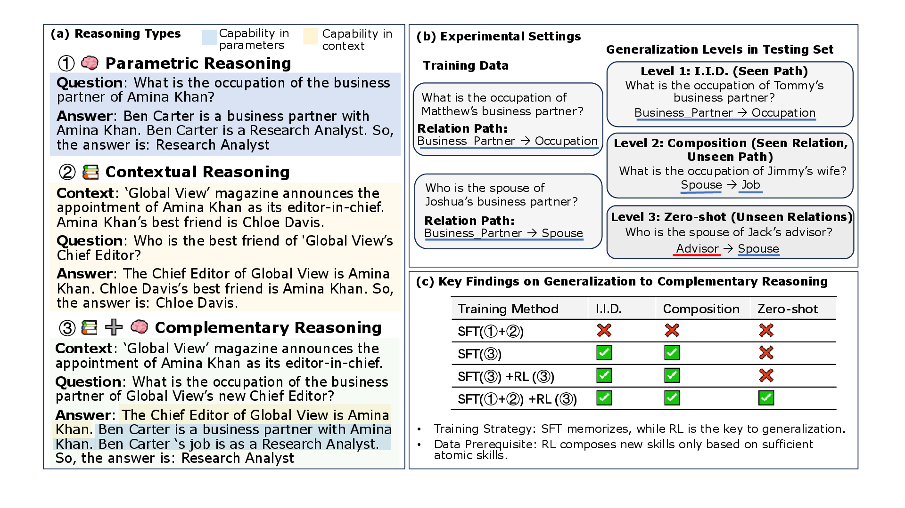

# From Atomic to Composite

Code and data for the paper 

[**From Atomic to Composite: Reinforcement Learning Enables Generalization in Complementary Reasoning**](https://arxiv.org/pdf/2512.01970).

Here is the main experiment settings and findings of our paper.


We release the code to generate synthetic human biographies with a knowledge graph.

We opensource the training and testing data for parametric, contextual and complementary reasoning. The testing data is splited based on three level of generalization difficulty (i.e., I.I.D., composition, zero-shot generalization). The training data is sufficient to achieve excellent I.I.D. performance.

## File Descriptions

- `build_training_and_testing_data.py`: Constructs the training and testing dataset by three levels of generalization difficulty. 
- `data_split_by_portion.py`: Splits the dataset into different portions of subsets for SFT and RL.
- `datagen_profile.py`: The main script for generating synthetic human biographies (profiles) with rich attributes and relationships.
- `relations.py`: Defines the relationship templates and logic for generating various combinations of relationships.
- `reshape_q_template.py`: Processes and reshapes question templates to create the final question-answer pairs for each relation combinations.

## Citation

If you find this repository useful, please cite our paper:

```bibtex
@article{cheng2025atomic,
  title={From Atomic to Composite: Reinforcement Learning Enables Generalization in Complementary Reasoning},
  author={Cheng, Sitao and Yin, Xunjian and Zhou, Ruiwen and Li, Yuxuan and Wang, Xinyi and Pan, Liangming and Wang, William Yang and Zhong, Victor},
  journal={arXiv preprint arXiv:2512.01970},
  year={2025}
}
``` 