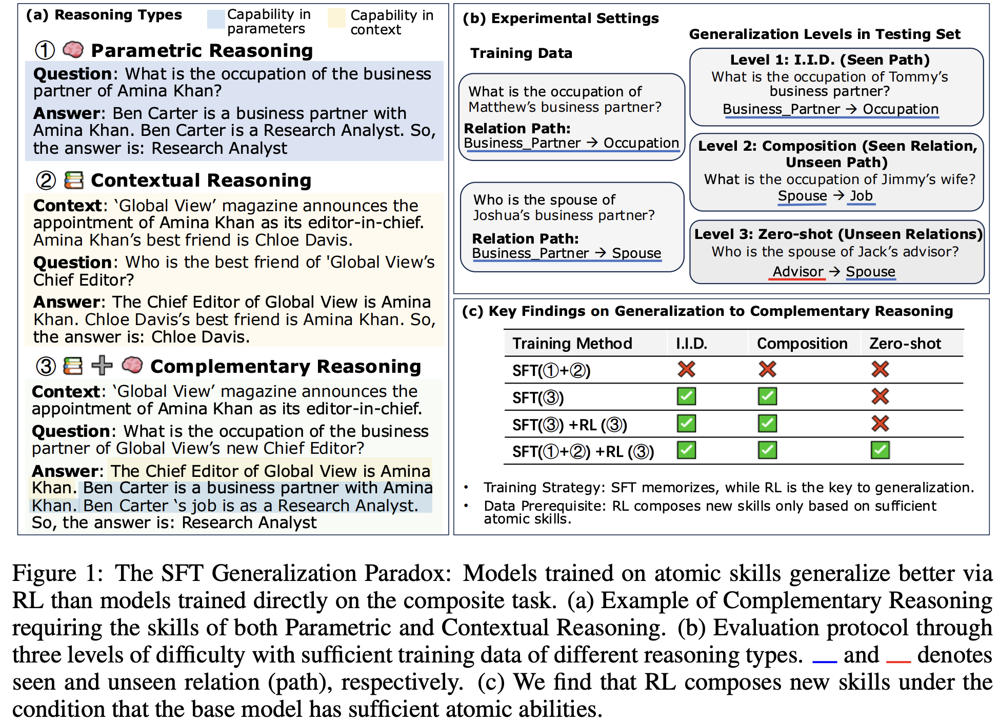

<div align="center">

<h1>From Atomic to Composite: Reinforcement Learning Enables Generalization in Complementary Reasoning</h1>

<a href="https://arxiv.org/pdf/2512.01970">
  
</a><a href="https://huggingface.co/your-model">
  
</a><a href="https://github.com/sitaocheng/DERL">
  
</a>
</div>
<p align="center">
<a href="#overview">[Overview]</a>
<a href="#file-descriptions">[File Discriptions]</a>
<a href="#citation">[Citation]</a>
</p>
<hr>


This repo contains the raw data and code to generate synthetic human biographies with a knowledge graph. The training and testing data can be directly adapted to frameworks like [LLamafactory](https://github.com/hiyouga/LLaMA-Factory) or [VeRL](https://github.com/volcengine/verl). 


## Overview

Here is the main experiment settings and findings of our paper.



We opensource the training and testing data for parametric, contextual and complementary reasoning. 

The training data is in the format of SFT full fine-tuning for LLamafactory. It contains the paramtric knowledge and QA-pairs for each reasoning type. For reinforcement learning (RL), we only adopt QA-pairs. To use VeRL, please adopt the data preprocess script to prepare the data.

Example:
```
  "question": "Can you tell me the phone number of the boss of Justin Martinez's roommate?",
  "answer": "6548113713",
  "answer_cot": "Justin Martinez shared a room with Carl Jarvis. Frederick Juarez is the boss of Carl Jarvis. Frederick Juarez's phone number is 6548113713. So, the answer is: 6548113713",
  "instruction": "Answer the following question.",
  "gen_type": "composition"
```

The testing data is splited based on three level of generalization difficulty (i.e., I.I.D., composition, zero-shot generalization). The training data is sufficient to achieve excellent I.I.D. performance.

## File Descriptions


- `build_training_and_testing_data.py`: Constructs the training and testing dataset by three levels of generalization difficulty. 
- `data_split_by_portion.py`: Splits the dataset into different portions of subsets for SFT and RL.
- `datagen_profile.py`: The main script for generating synthetic human biographies (profiles) with rich attributes and relationships.
- `relations.py`: Defines the relationship templates and logic for generating various combinations of relationships.
- `reshape_q_template.py`: Processes and reshapes question templates to create the final question-answer pairs for each relation combinations.

## Citation

If you find this repository useful, please cite our paper:

```bibtex
@article{cheng2025atomic,
  title={From Atomic to Composite: Reinforcement Learning Enables Generalization in Complementary Reasoning},
  author={Cheng, Sitao and Yin, Xunjian and Zhou, Ruiwen and Li, Yuxuan and Wang, Xinyi and Pan, Liangming and Wang, William Yang and Zhong, Victor},
  journal={arXiv preprint arXiv:2512.01970},
  year={2025}
}
``` 